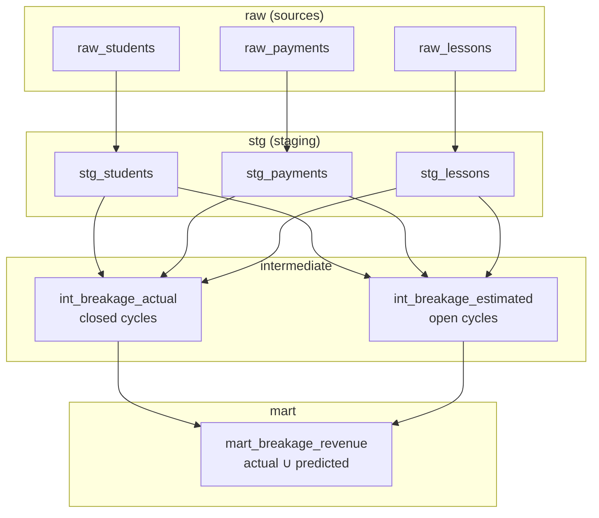
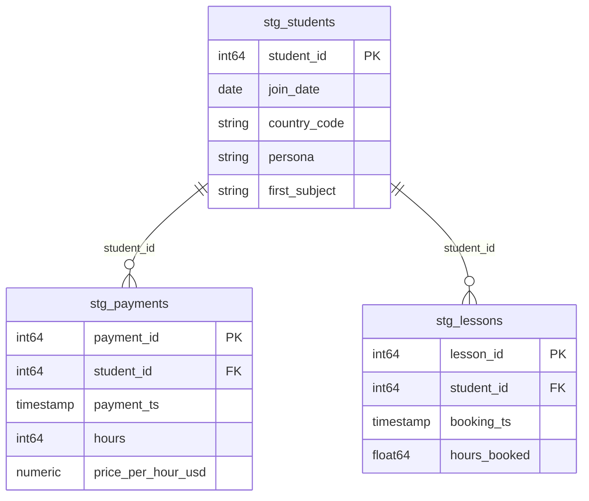
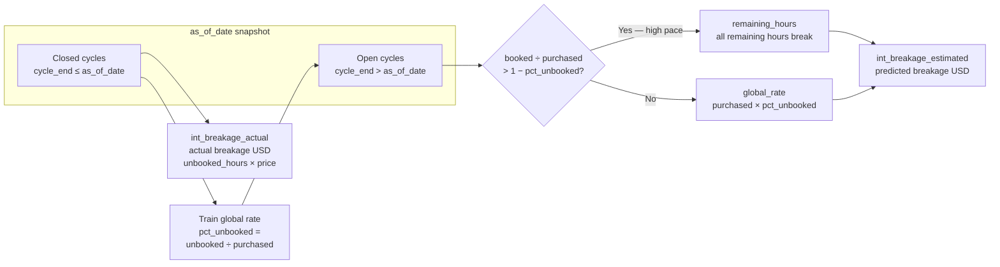

# Preply Analytics Engineer — Case Study

---

## Dashboard

[https://datastudio.google.com/s/ms90M8p25nA](https://datastudio.google.com/s/ms90M8p25nA)

## Setup local dbt execution (PowerShell)

Ensure all the dependencies from requirements.txt are installed. 

Then from the project root activate virtual environment and load variables (use .env.example for reference):

```powershell
.\.venv\Scripts\Activate.ps1
.\scripts\load_env.ps1
```

`load_env.ps1` reads `.env` and sets `BQ_PROJECT_ID`, `BQ_DATASET_*`, `DBT_PROFILES_DIR`, `DBT_TARGET`, etc. for the current shell.

---

## Modelling approach

The project follows a layered dbt pattern: light staging on raw CSVs, business logic in intermediate models, and a single payment-grain mart for Looker. Each layer has a dedicated BigQuery dataset and YAML for column docs (`persist_docs` pushes descriptions on dbt execution into the BQ console).

### Design principles


| Layer            | Dataset        | Purpose                                                                          |
| ---------------- | -------------- | -------------------------------------------------------------------------------- |
| **Sources**      | `raw`          | Synthetic CSVs loaded once into BQ; not transformed by dbt                       |
| **Staging**      | `stg`          | Type casts, date fields, no business rules — EDA showed clean keys               |
| **Intermediate** | `intermediate` | 28-day payment cycles, lesson utilization in cycle, breakage actual vs estimated |
| **Marts**        | `mart`         | Union of actual + predicted breakage at `payment_id` grain for PayOps dashboard  |


**Snapshot date:** `as_of_date` (default `2026-04-17` in `dbt_project.yml`) splits payments into **closed** vs **open** cycles for breakage logic. In production this would typically be yesterday.

**Payment cycles:** Each payment starts a cycle; the cycle ends at the next payment or, for the last payment per student, **+28 days** (`macros/payments_with_cycle.sql`). Lessons booked in `[cycle_start, cycle_end)` count toward utilization.

### Layer flow (schema)




### Entity relationships (staging)




Intermediate models attach **student dimensions** to each **payment** and compute cycle-level booked vs purchased hours. The mart exposes one row per `payment_id` with `type` = `actual` | `predicted` (see Step 4 for estimation logic).

### Model grain


| Model                    | Grain                          | Key                                           |
| ------------------------ | ------------------------------ | --------------------------------------------- |
| `stg_students`           | 1 row / student                | `student_id`                                  |
| `stg_payments`           | 1 row / payment                | `payment_id`                                  |
| `stg_lessons`            | 1 row / lesson booking         | `lesson_id`                                   |
| `int_breakage_actual`    | 1 row / payment (closed cycle) | `payment_id`                                  |
| `int_breakage_estimated` | 1 row / payment (open cycle)   | `payment_id`                                  |
| `mart_breakage_revenue`  | 1 row / payment                | `payment_id` + `type` implied by source union |


Closed and open cycles are **mutually exclusive** at `as_of_date`, so `payment_id` is unique in the mart.

### Data quality tests

**Schema tests** (YAML): `unique`, `not_null`, `accepted_values` on keys and mart `type`.

**Singular test** (SQL under `tests/`):


| Test                                                   | What it checks                                                                                                                                                                        |
| ------------------------------------------------------ | ------------------------------------------------------------------------------------------------------------------------------------------------------------------------------------- |
| `assert_stg_payments_covered_by_mart_breakage_revenue` | Every `stg_payments.payment_id` has a row in `mart_breakage_revenue` (full coverage). Works with mart `unique` on `payment_id`: together they imply exactly one mart row per payment. |


---

## Step 1

### Environment and raw data in BigQuery, dbt setup

A Python virtual environment was created and **dbt-bigquery** was installed via `requirements.txt`. Connection settings were defined in `.env`  file.

Three synthetic CSVs in the repository root were uploaded to the **raw** dataset in the configured GCP project

## Step 2

### Raw data EDA

- Duplicates check on payment_id, student_id, lesson_id, data types investigation
- Offcycle payments check (no outliers, 28 days)

## Step 3

### Staging data preparation

Three stg_* models on payments, lessons, students created. No major transformations since raw data is clean (based on EDA).  

## Step 4

### Intermediate data layer

Created two intermediate tables: `int_breakage_actual` (closed cycles — final breakage fact) and `int_breakage_estimated` (open cycles — estimated breakage at `as_of_date`).

**How breakage prediction works (schema):**




At `as_of_date`, each payment sits in exactly one bucket:


| Cycle status | Model                    | Breakage                                                      |
| ------------ | ------------------------ | ------------------------------------------------------------- |
| **Closed**   | `int_breakage_actual`    | **Actual** — final unbooked hours in the full cycle × price   |
| **Open**     | `int_breakage_estimated` | **Predicted** — uses global history + utilization guard below |


**Breakage estimation formula (open cycles):**

1. Compute `% unbooked` from closed payment cycles as of the snapshot date (global average: unbooked / purchased).
2. For each open cycle:
  - Default (`global_rate`): `estimated_unbooked = hours_purchased × pct_unbooked` (same pack basis as fact).
  - High-utilization guard (`remaining_hours`): if `booked / purchased > 1 - pct_unbooked`, assume all remaining hours break → `estimated_breakage = hours_remaining × price_per_hour`

Note on cohort approach:

Before fixing the estimation formula shown above, we compared the unbooked rates for cohorts. Three variants were backtested on historical snapshots - `analyses/breakage_backtest_cohort_strategy_comparison.sql`, `notebooks/cohort_backtest_analysis.ipynb` ;


| Variant      | Cohort rate                                                         |
| ------------ | ------------------------------------------------------------------- |
| Hierarchy    | specific (country + persona + channel) → generic (country) → global |
| Generic-only | country-level                                                       |
| Global-only  | single company-wide rate                                            |


Depending on the backtest as_of_date variable winning cohort varied but all had relatively high WAPE (~0.6) and tend to overestimate the breakage revenue. Overestimation tends to happend because we do not consider utilization specifics of different students during the backtest (e.g. emergency bookings on last day) - later on we define guardrails to partially fix high utilization pace but not the last day problem. Since the goal was to understand whether specific cohort matching might bring in any substantial improvements we've taken our learnings but for PayOps team overestimates on revenue might be unacceptable meaning current estimation approach needs updates. For this case-study we stick to global_only approach given that specific cohort matching. 

## Step 5

### Mart layer for dashboarding

Built `mart_breakage_revenue` in the `mart` dataset — a single payment-grain table for Looker that combines actual and predicted breakage revenue (unbooked hours × price only; not booked lesson value).

One row per `payment_id` (closed and open cycles are mutually exclusive).


| `type`        | Source                   | Meaning                         |
| ------------- | ------------------------ | ------------------------------- |
| **actual**    | `int_breakage_actual`    | Closed cycle — final breakage   |
| **predicted** | `int_breakage_estimated` | Open cycle — estimated breakage |


---

## Step 6

### Looker dashboard (PayOps)

Looker dashboard was built for the PayOps team focusing only on breakage revenue.

`as_of_date` in practice:

- In production, PayOps typically runs this as of yesterday — the latest complete snapshot (`as_of_date = current_date - 1`).
- In this case study the snapshot is hardcoded to `2026-04-17` (end of the synthetic dataset to preserve some payments as open).

The dashboard is fed from `mart.mart_breakage_revenue` in BigQuery (dbt model `mart_breakage_revenue`).

---

## AI helpful

**Cursor** was used the following way:

- Environment and repo — dbt project layout, `.env` / profile templates, and routing across BigQuery datasets (`raw` / `stg` / `mart`).
- Local dbt deployment — dependency installation, BigQuery connection profile, and scripts for env loading and running dbt with the correct target.
- Formatting SQL code, validating typos, readme.
- Documentation for models that was automatically propagated to BQ UI
- Readme file formatting and highlighting
- Brainstorm dbt tests and alternatives to breakage estimation
- Python code generation for backtest simulation

## AI rejected

- overengineering on incremental tables loading (resulted in missing data);
- too many macros suggested (harder to read given the project size);
- considered booked hours as revenue (wrong business context);

---

## Next steps

Business improvements:

- consider implementing deeper prediction model on breakage to avoid overestimates (by taking into account utilization pace, cycle day number)
- room for Bayes prior/posterior estimates with further adjustments depending on student behavior
- extend the dashboard with other charts or tabs (evolution of breakage estimates)

**Technical improvements:**

- incremental logic for data modeling (infra costs)
- snapshots for tracking the changes of breakage estimates (monitor estimates precision and visualize it in a dashboard)
- (only if there is a business need, e.g. cases of cycle duration change) - incorporate corresponding variables into dbt models to make it easier to make changes to models;
- more tests / validation / EDA to be used as guardrails in case real raw data is messy

